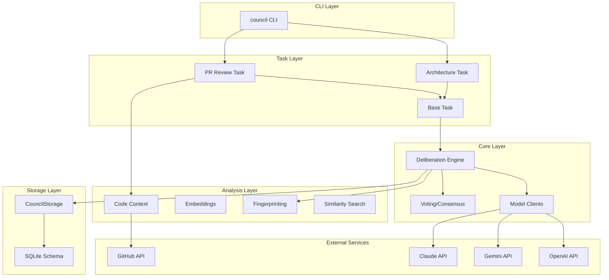
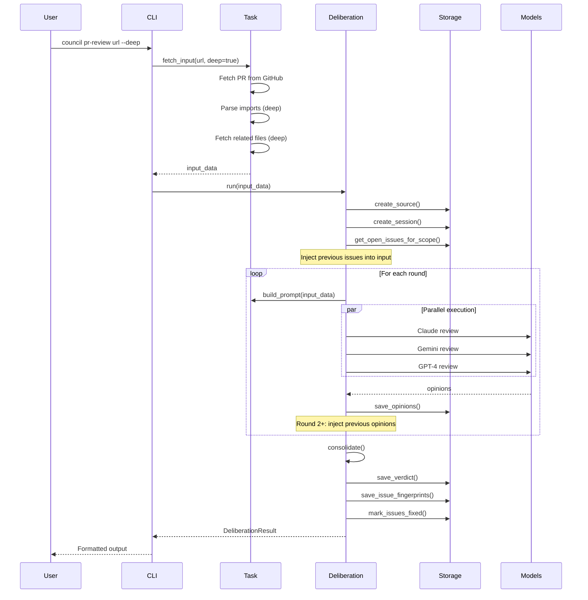
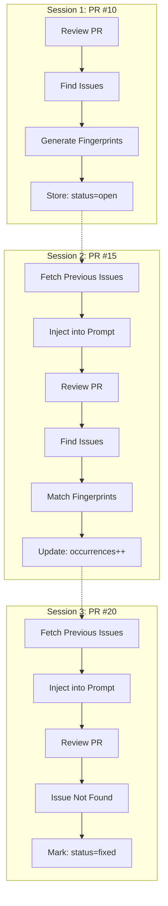
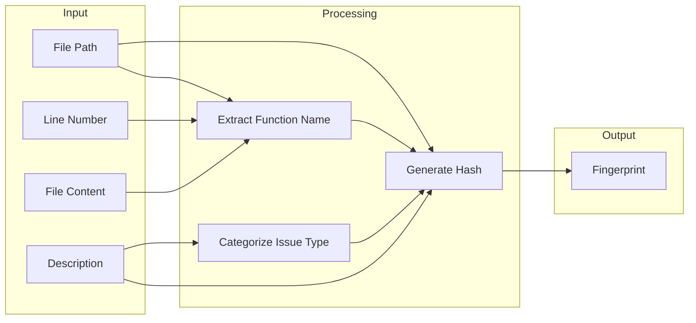
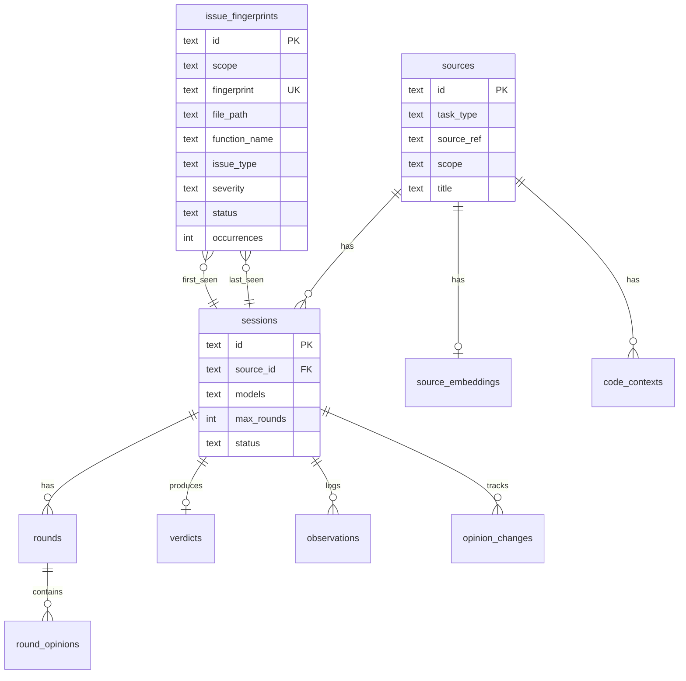
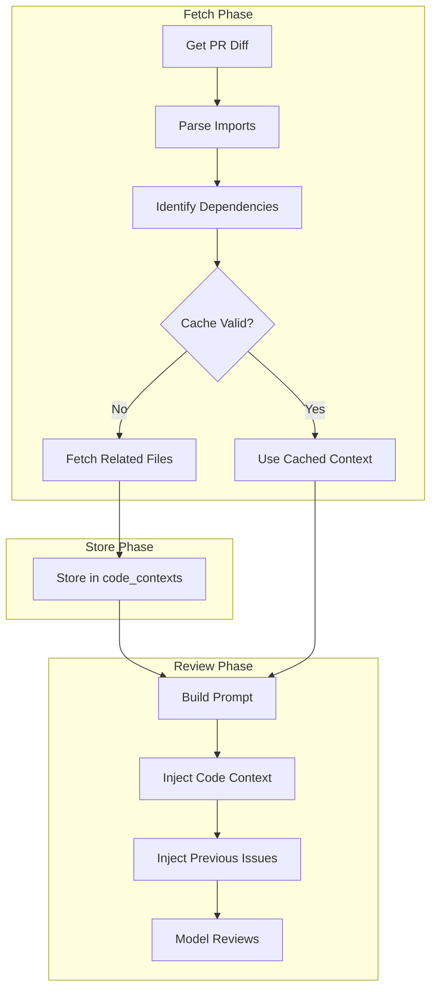

# Model Council Architecture

## System Overview

```mermaid
flowchart TB
    subgraph CLI["CLI Layer"]
        cmd[council CLI]
    end
    
    subgraph Tasks["Task Layer"]
        pr[PR Review Task]
        arch[Architecture Task]
        base[Base Task]
    end
    
    subgraph Core["Core Layer"]
        delib[Deliberation Engine]
        voting[Voting/Consensus]
        models[Model Clients]
    end
    
    subgraph Analysis["Analysis Layer"]
        context[Code Context]
        embed[Embeddings]
        finger[Fingerprinting]
        similar[Similarity Search]
    end
    
    subgraph Storage["Storage Layer"]
        storage[CouncilStorage]
        schema[SQLite Schema]
    end
    
    subgraph External["External Services"]
        github[GitHub API]
        claude[Claude API]
        gemini[Gemini API]
        openai[OpenAI API]
    end
    
    cmd --> pr
    cmd --> arch
    pr --> base
    arch --> base
    
    base --> delib
    delib --> voting
    delib --> models
    
    pr --> context
    delib --> finger
    delib --> storage
    
    context --> github
    models --> claude
    models --> gemini
    models --> openai
    
    storage --> schema
```

## Review Flow

```mermaid
sequenceDiagram
    participant User
    participant CLI
    participant Task
    participant Delib as Deliberation
    participant Storage
    participant Models
    
    User->>CLI: council pr-review url --deep
    CLI->>Task: fetch_input(url, deep=true)
    Task->>Task: Fetch PR from GitHub
    Task->>Task: Parse imports (deep)
    Task->>Task: Fetch related files (deep)
    Task-->>CLI: input_data
    
    CLI->>Delib: run(input_data)
    Delib->>Storage: create_source()
    Delib->>Storage: create_session()
    Delib->>Storage: get_open_issues_for_scope()
    
    Note over Delib: Inject previous issues into input
    
    loop For each round
        Delib->>Task: build_prompt(input_data)
        
        par Parallel execution
            Delib->>Models: Claude review
            Delib->>Models: Gemini review
            Delib->>Models: GPT-4 review
        end
        
        Models-->>Delib: opinions
        Delib->>Storage: save_opinions()
        
        Note over Delib: Round 2+: inject previous opinions
    end
    
    Delib->>Delib: consolidate()
    Delib->>Storage: save_verdict()
    Delib->>Storage: save_issue_fingerprints()
    Delib->>Storage: mark_issues_fixed()
    
    Delib-->>CLI: DeliberationResult
    CLI-->>User: Formatted output
```

## Issue Tracking Flow

```mermaid
flowchart TB
    subgraph Session1["Session 1: PR #10"]
        s1_review[Review PR]
        s1_find[Find Issues]
        s1_fp[Generate Fingerprints]
        s1_store[Store: status=open]
    end
    
    subgraph Session2["Session 2: PR #15"]
        s2_fetch[Fetch Previous Issues]
        s2_inject[Inject into Prompt]
        s2_review[Review PR]
        s2_find[Find Issues]
        s2_match[Match Fingerprints]
        s2_update[Update: occurrences++]
    end
    
    subgraph Session3["Session 3: PR #20"]
        s3_fetch[Fetch Previous Issues]
        s3_inject[Inject into Prompt]
        s3_review[Review PR]
        s3_notfound[Issue Not Found]
        s3_fixed[Mark: status=fixed]
    end
    
    s1_review --> s1_find --> s1_fp --> s1_store
    s1_store -.-> s2_fetch
    
    s2_fetch --> s2_inject --> s2_review --> s2_find --> s2_match --> s2_update
    s2_update -.-> s3_fetch
    
    s3_fetch --> s3_inject --> s3_review --> s3_notfound --> s3_fixed
```

## Fingerprint Generation

```mermaid
flowchart LR
    subgraph Input
        file[File Path]
        line[Line Number]
        desc[Description]
        code[File Content]
    end
    
    subgraph Processing
        func[Extract Function Name]
        cat[Categorize Issue Type]
        hash[Generate Hash]
    end
    
    subgraph Output
        fp[Fingerprint]
    end
    
    file --> func
    line --> func
    code --> func
    
    desc --> cat
    
    file --> hash
    func --> hash
    cat --> hash
    desc --> hash
    
    hash --> fp
```

## Database Schema

```mermaid
erDiagram
    sources ||--o{ sessions : has
    sources ||--o| source_embeddings : has
    sources ||--o{ code_contexts : has
    sessions ||--o{ rounds : has
    sessions ||--o| verdicts : produces
    sessions ||--o{ observations : logs
    sessions ||--o{ opinion_changes : tracks
    rounds ||--o{ round_opinions : contains
    
    issue_fingerprints }o--|| sessions : first_seen
    issue_fingerprints }o--|| sessions : last_seen
    
    sources {
        text id PK
        text task_type
        text source_ref
        text scope
        text title
    }
    
    sessions {
        text id PK
        text source_id FK
        text models
        int max_rounds
        text status
    }
    
    issue_fingerprints {
        text id PK
        text scope
        text fingerprint UK
        text file_path
        text function_name
        text issue_type
        text severity
        text status
        int occurrences
    }
```

## Deep Analysis Flow

```mermaid
flowchart TB
    subgraph Fetch["Fetch Phase"]
        diff[Get PR Diff]
        parse[Parse Imports]
        identify[Identify Dependencies]
        cache_check{Cache Valid?}
        fetch_files[Fetch Related Files]
        use_cache[Use Cached Context]
    end
    
    subgraph Store["Store Phase"]
        store_context[Store in code_contexts]
    end
    
    subgraph Review["Review Phase"]
        build[Build Prompt]
        inject_context[Inject Code Context]
        inject_issues[Inject Previous Issues]
        model_review[Model Reviews]
    end
    
    diff --> parse --> identify --> cache_check
    cache_check -->|No| fetch_files --> store_context
    cache_check -->|Yes| use_cache
    
    store_context --> build
    use_cache --> build
    
    build --> inject_context --> inject_issues --> model_review
```
